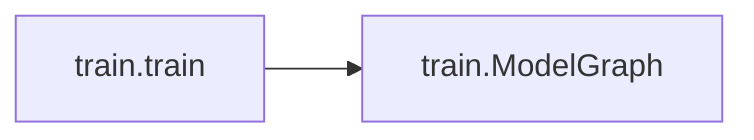
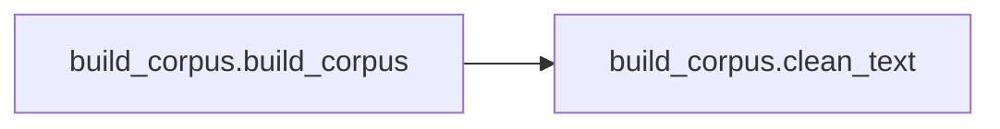
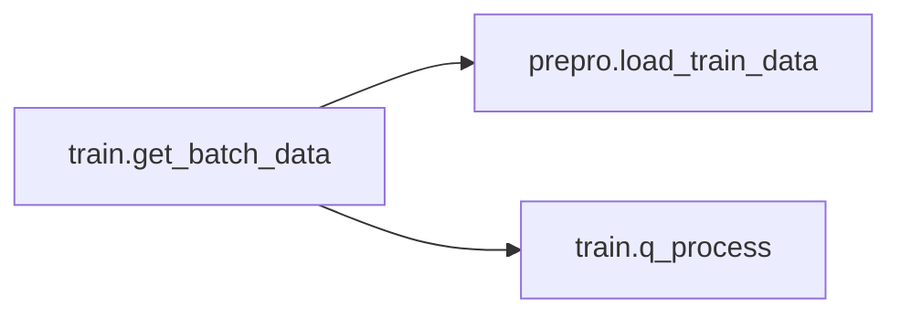
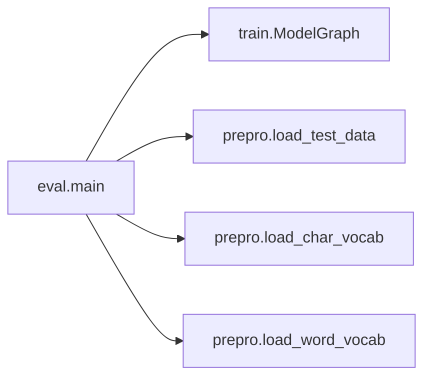
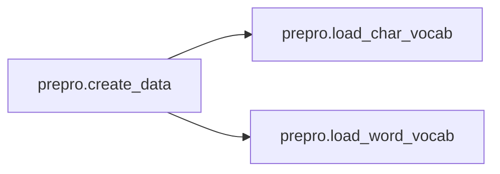

# Key Objects

[_Documentation generated by Documatic_](https://www.documatic.com)

<!---Documatic-section-prepro.create_word_vocab-start--->
## prepro.create_word_vocab

<!---Documatic-section-create_word_vocab-start--->
<!---Documatic-block-prepro.create_word_vocab-start--->
<details>
	<summary><code>prepro.create_word_vocab</code> code snippet</summary>

```python
def create_word_vocab():
    from collections import Counter
    from itertools import chain
    words = codecs.open('data/en_wikinews.txt', 'r', 'utf-8').read().split()
    word2cnt = Counter(chain(words))
    vocab = ['<EMP>', '<UNK>'] + [word for (word, cnt) in word2cnt.items() if cnt > 50]
    word2idx = {word: idx for (idx, word) in enumerate(vocab)}
    idx2word = {idx: word for (idx, word) in enumerate(vocab)}
    pickle.dump((word2idx, idx2word), open('data/word_vocab.pkl', 'wb'))
```
</details>
<!---Documatic-block-prepro.create_word_vocab-end--->
<!---Documatic-section-create_word_vocab-end--->

# #
<!---Documatic-section-prepro.create_word_vocab-end--->

<!---Documatic-section-prepro.load_train_data-start--->
## prepro.load_train_data

<!---Documatic-section-load_train_data-start--->
<!---Documatic-block-prepro.load_train_data-start--->
<details>
	<summary><code>prepro.load_train_data</code> code snippet</summary>

```python
def load_train_data():
    X = np.load('data/train.npz')['X'][:-64]
    Y = np.load('data/train.npz')['Y'][:-64]
    return (X, Y)
```
</details>
<!---Documatic-block-prepro.load_train_data-end--->
<!---Documatic-section-load_train_data-end--->

# #
<!---Documatic-section-prepro.load_train_data-end--->

<!---Documatic-section-train.train-start--->
## train.train

<!---Documatic-section-train-start--->


### Object Calls

* train.ModelGraph

<!---Documatic-block-train.train-start--->
<details>
	<summary><code>train.train</code> code snippet</summary>

```python
def train():
    g = ModelGraph()
    print('Graph loaded!')
    tf.sg_train(optim='Adam', lr=1e-05, lr_reset=True, loss=g.reduced_loss, eval_metric=[], max_ep=20000, save_dir='asset/train', early_stop=False, ep_size=g.num_batch)
```
</details>
<!---Documatic-block-train.train-end--->
<!---Documatic-section-train-end--->

# #
<!---Documatic-section-train.train-end--->

<!---Documatic-section-build_corpus.build_corpus-start--->
## build_corpus.build_corpus

<!---Documatic-section-build_corpus-start--->


### Object Calls

* build_corpus.clean_text

<!---Documatic-block-build_corpus.build_corpus-start--->
<details>
	<summary><code>build_corpus.build_corpus</code> code snippet</summary>

```python
def build_corpus():
    import glob
    with codecs.open('data/en_wikinews.txt', 'w', 'utf-8') as fout:
        fs = glob.glob('data/raw/*.xml')
        ns = '{http://www.mediawiki.org/xml/export-0.10/}'
        for f in fs:
            i = 1
            for (_, elem) in ET.iterparse(f, tag=ns + 'text'):
                try:
                    if i > 5000:
                        running_text = elem.text
                        running_text = running_text.split('===')[0]
                        running_text = clean_text(running_text)
                        paras = running_text.split('\n')
                        for para in paras:
                            if len(para) > 500:
                                sents = [regex.sub('([.!?]+$)', ' \\1', sent) for sent in sent_tokenize(para.strip())]
                                fout.write(' '.join(sents) + '\n')
                except:
                    continue
                elem.clear()
                i += 1
                if i % 1000 == 0:
                    print(i)
```
</details>
<!---Documatic-block-build_corpus.build_corpus-end--->
<!---Documatic-section-build_corpus-end--->

# #
<!---Documatic-section-build_corpus.build_corpus-end--->

<!---Documatic-section-train.get_batch_data-start--->
## train.get_batch_data

<!---Documatic-section-get_batch_data-start--->


### Object Calls

* prepro.load_train_data
* train.q_process

<!---Documatic-block-train.get_batch_data-start--->
<details>
	<summary><code>train.get_batch_data</code> code snippet</summary>

```python
def get_batch_data():
    (X, Y) = load_train_data()
    (x_q, y_q) = tf.train.slice_input_producer([tf.convert_to_tensor(X, tf.int32), tf.convert_to_tensor(Y, tf.int32)])
    (x_q, y_q) = q_process(x_q, y_q)
    (x, y) = tf.train.shuffle_batch([x_q, y_q], num_threads=32, batch_size=Hyperparams.batch_size, capacity=Hyperparams.batch_size * 64, min_after_dequeue=Hyperparams.batch_size * 32, allow_smaller_final_batch=False)
    num_batch = len(X) // Hyperparams.batch_size
    return (x, y, num_batch)
```
</details>
<!---Documatic-block-train.get_batch_data-end--->
<!---Documatic-section-get_batch_data-end--->

# #
<!---Documatic-section-train.get_batch_data-end--->

<!---Documatic-section-train.q_process-start--->
## train.q_process

<!---Documatic-section-q_process-start--->
<!---Documatic-block-train.q_process-start--->
<details>
	<summary><code>train.q_process</code> code snippet</summary>

```python
def q_process(t1, t2):
    zeros = tf.equal(t1, tf.zeros_like(t1)).sg_int().sg_sum()
    t1 = t1[zeros:]
    t2 = t2[zeros:]
    t1 = tf.concat([tf.zeros([Hyperparams.seqlen - 1], tf.int32), t1], 0)
    t2 = tf.concat([tf.zeros([Hyperparams.seqlen - 1], tf.int32), t2], 0)
    stacked = tf.stack((t1, t2))
    cropped = tf.random_crop(stacked, [2, Hyperparams.seqlen])
    (t1, t2) = (cropped[0], cropped[1])
    t2 = t2[-1]
    return (t1, t2)
```
</details>
<!---Documatic-block-train.q_process-end--->
<!---Documatic-section-q_process-end--->

# #
<!---Documatic-section-train.q_process-end--->

<!---Documatic-section-eval.main-start--->
## eval.main

<!---Documatic-section-main-start--->


### Object Calls

* train.ModelGraph
* prepro.load_test_data
* prepro.load_char_vocab
* prepro.load_word_vocab

<!---Documatic-block-eval.main-start--->
<details>
	<summary><code>eval.main</code> code snippet</summary>

```python
def main():
    g = ModelGraph(mode='test')
    with tf.Session() as sess:
        tf.sg_init(sess)
        saver = tf.train.Saver()
        saver.restore(sess, tf.train.latest_checkpoint('asset/train'))
        print('Restored!')
        mname = open('asset/train/checkpoint', 'r').read().split('"')[1]
        (X, Y) = load_test_data()
        (char2idx, idx2char) = load_char_vocab()
        (word2idx, idx2word) = load_word_vocab()
        results = []
        rk = 0
        num_para = 1
        num_char = 1
        for (x, y) in zip(X, Y):
            stop_counting = False
            x = np.concatenate((np.zeros((Hyperparams.seqlen - 1,)), x[-np.count_nonzero(x):]))
            para = ''.join([idx2char[idx] for idx in x])
            (chars, targets) = ([], [])
            for word in ''.join(para).split():
                chars.append(' ')
                targets.append(word)
                for char in word:
                    chars.append(char)
                    targets.append(word)
            prefix = ''
            preds = set()
            for (i, char_target) in enumerate(zip(chars, targets)):
                (char, target) = char_target
                oov = ''
                if target not in word2idx:
                    oov = 'oov'
                if i > Hyperparams.seqlen:
                    ctx = np.array(x[i - Hyperparams.seqlen:i], np.int32)
                    if char == ' ':
                        stop_counting = False
                        preds = set()
                    if not stop_counting:
                        logits = sess.run(g.logits, {g.x: np.expand_dims(ctx, 0)})
                        while 1:
                            pred = np.argmax(logits, -1)[0]
                            if pred in preds:
                                logits[:, pred] = -100000000
                            else:
                                break
                        rk += 1
                        predword = idx2word.get(pred)
                        if predword == target:
                            stop_counting = True
                        preds.add(pred)
                    results.append(u'{},{},{},{},{},{},{}'.format(num_char, num_para, char, target, oov, predword, rk))
                    num_char += 1
            num_para += 1
        with codecs.open('data/output_{}_rk_{}.csv'.format(mname, rk), 'w', 'utf-8') as fout:
            fout.write('\n'.join(results))
```
</details>
<!---Documatic-block-eval.main-end--->
<!---Documatic-section-main-end--->

# #
<!---Documatic-section-eval.main-end--->

<!---Documatic-section-prepro.load_char_vocab-start--->
## prepro.load_char_vocab

<!---Documatic-section-load_char_vocab-start--->
<!---Documatic-block-prepro.load_char_vocab-start--->
<details>
	<summary><code>prepro.load_char_vocab</code> code snippet</summary>

```python
def load_char_vocab():
    vocab = "EU abcdefghijklmnopqrstuvwxyz0123456789-.,?!'"
    char2idx = {char: idx for (idx, char) in enumerate(vocab)}
    idx2char = {idx: char for (idx, char) in enumerate(vocab)}
    return (char2idx, idx2char)
```
</details>
<!---Documatic-block-prepro.load_char_vocab-end--->
<!---Documatic-section-load_char_vocab-end--->

# #
<!---Documatic-section-prepro.load_char_vocab-end--->

<!---Documatic-section-prepro.load_word_vocab-start--->
## prepro.load_word_vocab

<!---Documatic-section-load_word_vocab-start--->
<!---Documatic-block-prepro.load_word_vocab-start--->
<details>
	<summary><code>prepro.load_word_vocab</code> code snippet</summary>

```python
def load_word_vocab():
    (word2idx, idx2word) = pickle.load(open('data/word_vocab.pkl', 'rb'))
    return (word2idx, idx2word)
```
</details>
<!---Documatic-block-prepro.load_word_vocab-end--->
<!---Documatic-section-load_word_vocab-end--->

# #
<!---Documatic-section-prepro.load_word_vocab-end--->

<!---Documatic-section-prepro.create_data-start--->
## prepro.create_data

<!---Documatic-section-create_data-start--->


### Object Calls

* prepro.load_char_vocab
* prepro.load_word_vocab

<!---Documatic-block-prepro.create_data-start--->
<details>
	<summary><code>prepro.create_data</code> code snippet</summary>

```python
def create_data():
    (char2idx, idx2char) = load_char_vocab()
    (word2idx, idx2word) = load_word_vocab()
    lines = codecs.open('data/en_wikinews.txt', 'r', 'utf-8').read().splitlines()
    (xs, ys) = ([], [])
    for line in lines:
        (x, y) = ([], [])
        for (i, word) in enumerate(line.split()):
            x.append(2)
            y.append(word2idx.get(word, 1))
            for char in word:
                x.append(char2idx.get(char, 1))
                y.append(word2idx.get(word, 1))
        if len(x) <= 1000:
            xs.append([0] * (1000 - len(x)) + x)
            ys.append([0] * (1000 - len(x)) + y)
    X = np.array(xs)
    Y = np.array(ys)
    print('X.shape =', X.shape, '\nY.shape =', Y.shape)
    np.savez('data/train.npz', X=X, Y=Y)
```
</details>
<!---Documatic-block-prepro.create_data-end--->
<!---Documatic-section-create_data-end--->

# #
<!---Documatic-section-prepro.create_data-end--->

<!---Documatic-section-prepro.load_test_data-start--->
## prepro.load_test_data

<!---Documatic-section-load_test_data-start--->
<!---Documatic-block-prepro.load_test_data-start--->
<details>
	<summary><code>prepro.load_test_data</code> code snippet</summary>

```python
def load_test_data():
    X = np.load('data/train.npz')['X'][-64:]
    Y = np.load('data/train.npz')['Y'][-64:]
    return (X, Y)
```
</details>
<!---Documatic-block-prepro.load_test_data-end--->
<!---Documatic-section-load_test_data-end--->

# #
<!---Documatic-section-prepro.load_test_data-end--->

<!---Documatic-section-build_corpus.clean_text-start--->
## build_corpus.clean_text

<!---Documatic-section-clean_text-start--->
<!---Documatic-block-build_corpus.clean_text-start--->
<details>
	<summary><code>build_corpus.clean_text</code> code snippet</summary>

```python
def clean_text(text):
    text = regex.sub('\\[http[^]]+? ([^]]+)]', '\\1', text)
    text = regex.sub('\\[http[^]]+]', '', text)
    text = regex.sub('(?s)<ref>.+?</ref>', '', text)
    text = regex.sub('(?s)<[^>]+>', '', text)
    text = regex.sub('&[a-z]+;', '', text)
    text = regex.sub('(?s){{.+?}}', '', text)
    text = regex.sub('(?s){.+?}', '', text)
    text = regex.sub('(?s)\\[\\[([^]]+\\|)', '', text)
    text = regex.sub('(?s)\\[\\[([^]]+\\:.+?]])', '', text)
    text = regex.sub("[']{5}", '', text)
    text = regex.sub("[']{3}", '', text)
    text = regex.sub("[']{2}", '', text)
    text = regex.sub(u"[^ \r\n\\p{Latin}\\d\\-'.?!]", ' ', text)
    text = text.lower()
    text = regex.sub('[ ]{2,}', ' ', text)
    return text
```
</details>
<!---Documatic-block-build_corpus.clean_text-end--->
<!---Documatic-section-clean_text-end--->

# #
<!---Documatic-section-build_corpus.clean_text-end--->

[_Documentation generated by Documatic_](https://www.documatic.com)